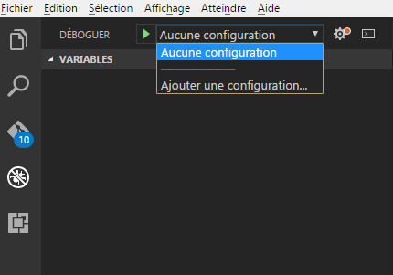

  [](https://recouv.sharepoint.com/sites/bureautechniquedsi-sded/SitePages/Socle-FullStack.aspx) 
                                                         
[](https://recouv.sharepoint.com/:f:/r/sites/bureautechniquedsi-sded/Documents%20partages/Architecture%20et%20Expertise%20Applicative/Norme%20Frontend%20Angular%20-%20Bootstrap)  
 [](http://gitlab.altair.recouv/sded/bureau-technique/architecture-expertise-applicative/fullstack/fullstack-spa-intranet)
  [](http://redmine.altair.recouv/projects/devintrafront/issues)
  [](https://www.yammer.com/recouv.fr/#/threads/inGroup?type=in_group&feedId=16003777&view=all)
  [](mailto:ac750-dsi-sded-bt-aea@acoss.fr)

Configuration des postes de développement
=========================================

Introduction
------------

Les points décrits ci-dessous sont des prérequis sauf en ce qui
concerne l’éditeur de code qui est plutôt une recommandation pour les équipes
internes.

Installation de NodeJS et NPM
-----------------------------

Télécharger et installer la dernière LTS de NodeJS :
<https://nodejs.org/en/download/>

Mettre à jour npm avec la commande suivante :

    npm update -g npm

Configuration de NPM
--------------------

Pour fonctionner correctement NPM doit être configuré pour : 
* Récupérer les dépendances depuis le nexus ACOSS (sans passer par le proxy)
* Aller chercher directement des scripts sur Internet (en passant par le proxy) 

Cette configuration se fait via le fichier *.npmrc* situé dans le répertoire home de l'utilisateur (généralement *C:\\Users\\[IDENTIFIANT ANAIS]\\*).

Pour plus d'informations vous pouvez vous reporter au [howto - Configurer npm à travers le proxy de l'acoss](http://gitlab.altair.recouv/sded/bureau-technique/architecture-expertise-applicative/fullstack/fullstack-spa-intranet/blob/develop/doc/howto%20-%20Configurer%20npm%20%C3%A0%20travers%20le%20proxy%20de%20l'acoss.md)

Installation de angularCli
--------------------------

L’installation d’Angular Cli se fait à l'aide de la commande :

    npm install -g @angular/cli

La documentation d’AngularCli est disponible ici :
<https://github.com/angular/angular-cli/wiki>

La documentation d’Angular est disponible ici : <https://angular.io/>

Utilisation d’un éditeur [RECOMMENDATION INTERNE]
-------------------------------------------------

Au sein de l’ACOSS, l’éditeur préconisé est Visual Studio Code téléchargeable
ici : <https://code.visualstudio.com/>

L’installation des plugins suivants est recommandé permettant de débugguer et de
vérifier le code source.


Le plugin TSLint utilise le fichier tslint.json des projets pour vérifier le
respect des règles.

Pour utiliser Chrome et debugger depuis Visual Studio Code il faut créer un
raccourci sur Chrome en passant les paramètres suivant :
_remote-debugging-port=9222_

Exemple : C:\\Applications\\GoogleChromePortable\\GoogleChromePortable.exe
_--remote-debugging-port=9222_

Vous devez activer les sources Maps :

-   Ouvrez Chrome sur un site Web

-   Ouvrez la fenêtre de debug avec F12

-   Ouvrez la fenêtre de setting en cliquant sur les trois petits points en haut
    à gauche de la fenêtre de debug

-   Cochez "Enable JavaScript source maps"


Configuration du Projet dans Visual Studio

-   Lancez Visual Studio

-   Ouvrez le projet avec le Menu Fichier/Ouvrir le Dossier

-   Sélectionnez le répertoire du projet [workspace]/[votre projet]

-   Allez dans le Debugger avec le raccourci Ctr + Maj + D

-   Cliquez sur la liste déroulante en haut pour ajouter une configuration

-   Sélectionnez Chrome



-   Vous pouvez supprimer la section Launch Chrome et ne garder que la
    configuration ci-dessous :
```json
    {
     "version": "0.2.0",
     "configurations": [{
        "name": "Attach Chrome",
        "type": "chrome",
        "request": "attach",
        "port": 9222,
        "webRoot": "\${workspaceRoot}"
        }
    ]
}

```
Pour debugger il suffit de lancer le Chrome en mode Debug avec le raccourci
configuré dans la documentation "Installation de l’environnement de
développement", et de lancer _Attach Chrome_ dans Visual Studio avec le bouton
vert.


Vous pourrez mettre des points d’arrêts dans le code typescript sur Visual
Studio Code.

Pour plus d'informations : https://code.visualstudio.com/docs/nodejs/angular-tutorial
